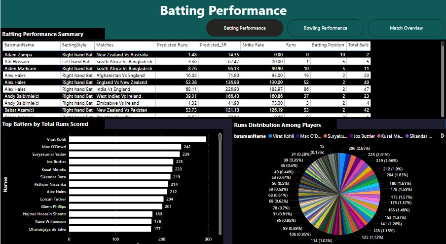
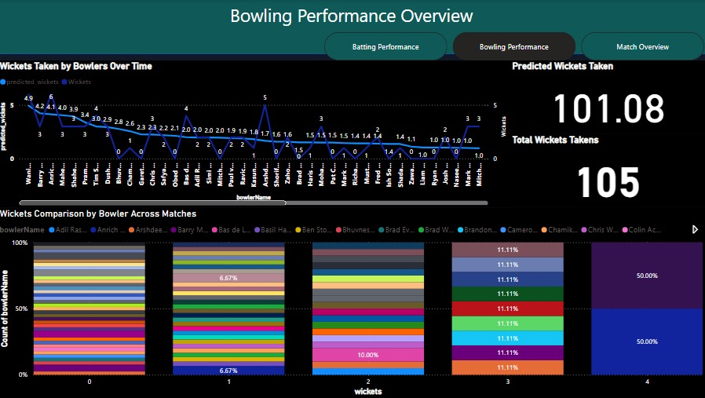
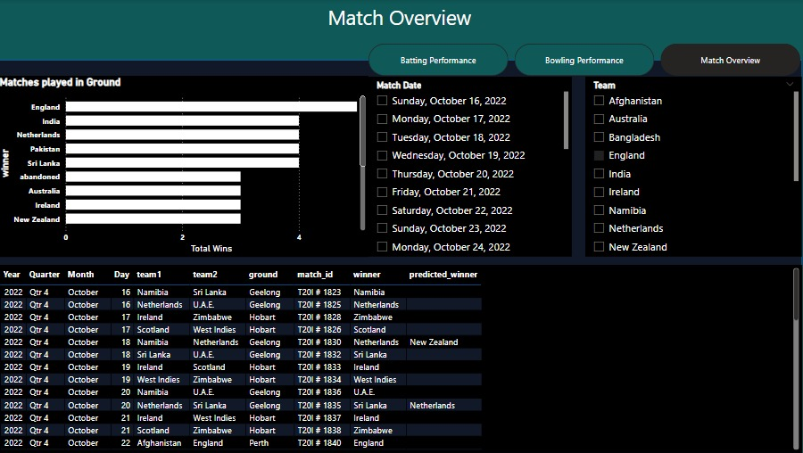

# 🏏 Cricket Match Outcome Prediction using Machine Learning

This is an end-to-end data science project that uses historical cricket match data to predict match outcomes using machine learning. The project involves data cleaning, analysis, modeling, and a basic prediction script. Ideal for cricket fans, fantasy players, and data science learners.

---

## 📌 Project Overview

- **Goal:** Predict the winner of a cricket match based on various match factors
- **Dataset:** IPL dataset (matches & deliveries) from [Kaggle](https://www.kaggle.com/datasets)
- **Techniques Used:**
  - Exploratory Data Analysis (EDA)
  - Feature Engineering
  - Classification Models
  - Model Evaluation (Accuracy, Confusion Matrix)

---

## 🎯 Objectives

1. Analyze cricket match data to understand patterns and trends
2. Engineer relevant features from raw match and delivery data
3. Train classification models to predict match outcome (winning team)
4. Build a reusable prediction function
5. (Optional) Prepare for deployment via Flask or Streamlit

---

## 🧪 Dataset Features

- Match Info: Season, Date, City, Venue
- Team Info: Batting Team, Bowling Team, Toss Winner, Toss Decision
- Match Outcome: Winner
- Additional: Umpires, Player of the Match, Match Result Type

---

## 🔧 Tools & Technologies

- **Language:** Python
- **Libraries:**
  - `pandas`, `numpy` for data handling
  - `matplotlib`, `seaborn` for visualization
  - `scikit-learn`, `xgboost` for modeling
- **Environment:** Jupyter Notebook / VS Code

---

---

## 🔍 Sample Use Case

```python
from src.model_utils import predict_match_outcome

features = {
    "batting_team": "Mumbai Indians",
    "bowling_team": "Chennai Super Kings",
    "venue": "Wankhede Stadium",
    "toss_winner": "Mumbai Indians",
    "toss_decision": "bat"
}
prediction = predict_match_outcome(features)
print("Predicted Winner:", prediction)
```

## 📊 Model Performance

Model Used: Random Forest Classifier (best performer)

Accuracy: ~78% on test data

Other Models Tested:

Logistic Regression

Decision Tree Classifier

XGBoost


## 🚀 Future Work

Deploy with Streamlit web app

Add live data scraping from ESPN or Cricbuzz

Predict player performance (runs, wickets, strike rate)

---

## 📎 Resources

📊 Power BI Dashboard:





---

## 📬 Contact

Your Name
📧 mijazhussnain83@gmail.com

⭐ If you found this project helpful, give it a ⭐ and share it!


